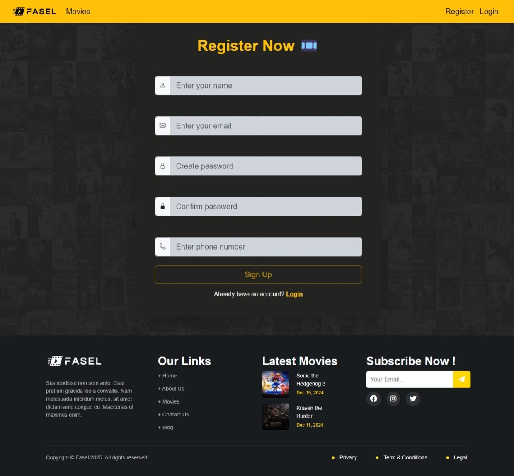

# Fasel 🎥

**Fasel** is a modern movie browsing web application built using **Angular 19**, powered by [TMDB](https://www.themoviedb.org/) APIs. Users can explore now playing movies, view details and recommendations, manage their wishlist, and search across a wide catalog.

## 🔥 Features

- View list of trending / now-playing movies
- Detailed movie pages with overview, rating, and recommendations
- Add/remove movies from wishlist with real-time feedback
- Wishlist page with persistent state
- Search movies by name
- Paginate through results
- 404 page for invalid routes
- Scroll-to-top on long pages

## 📄 Project Requirements Highlights

From the official ITI Angular course project brief:

- Consume TMDB APIs for listing, details, recommendations, and search
- Use Angular services, components, interfaces, routing, and pipes
- Optional: i18n with support for RTL languages like Arabic

Full brief available in [`movie-app-doc.pdf`](public/movie-app-doc.pdf)

## 🌐 Live Demo

- [fasel.vercel.app](https://fasel.vercel.app/home)

## 🖼️ Screenshots

Click any image to view full size.

<table>
  <tr>
    <td align="center">
       Home Page
    </td>
    <td align="center">
       Movies Page
    </td>
    <td align="center">
       Movie Details
        
       Register
    </td>
  </tr>
</table>

## ⚙️ Technologies Used

- Angular 19
- TypeScript
- HTML5, CSS3
- TMDB API

## 🧠 Personal Note

This project was built as part of the **Angular course** at the **Information Technology Institute (ITI)**, a prestigious tech institute under Egypt's Ministry of Communications. While it was a team effort, I didn't contribute heavily to the frontend development — my main focus remains on backend development (Laravel, Node.js, and backend systems in general). I still wanted to share it as part of my learning journey and collaborative experience.
